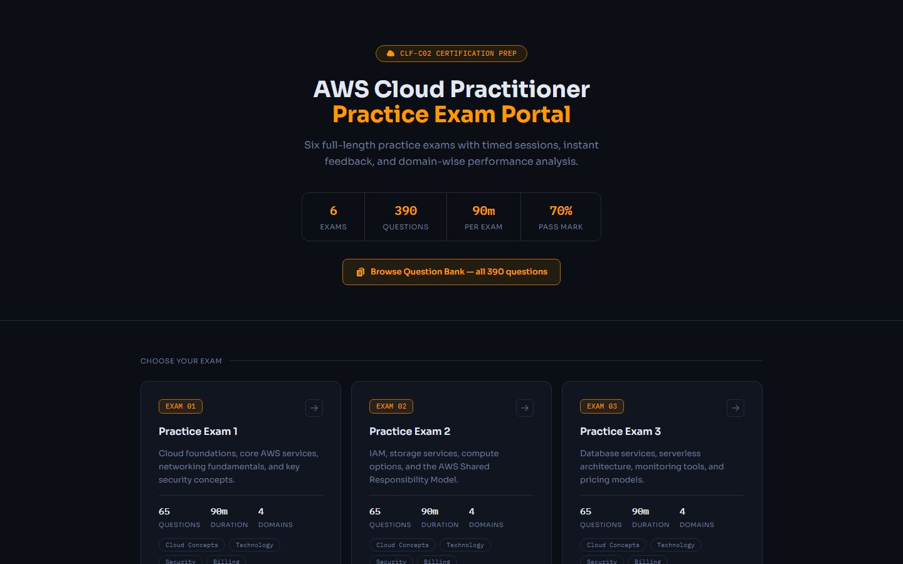
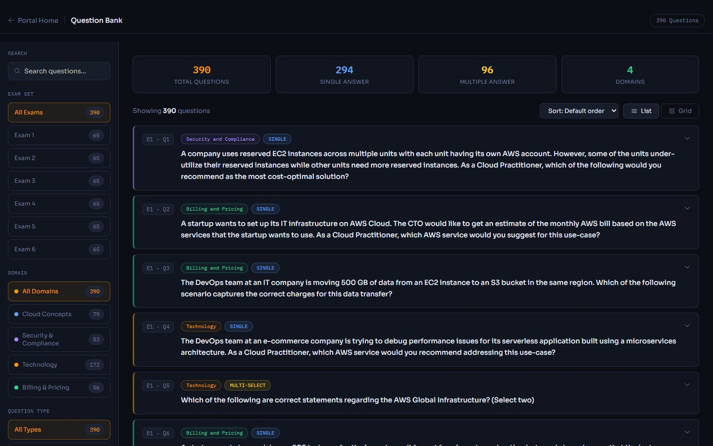
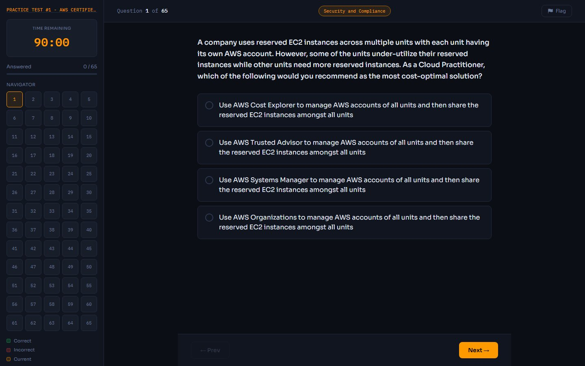

# AWS Cloud Practitioner : Practice Exam Portal

A self-hosted exam portal for AWS CLF-C02 practice tests, built with React, Vite, Tailwind CSS, and
`@material-tailwind/react`. Hosted via GitHub Pages.

## Live URL
**[abhishekwadmare.github.io/AWS-Exam-practice](https://abhishekwadmare.github.io/AWS-Exam-practice/)**

## Screenshots

| Portal — all 6 exams | Question Bank — 390 questions |
|---|---|
|  |  |

| Exam in progress |
|---|
|  |

---

## Development

```bash
npm install
npm run dev       # start the Vite dev server
npm test          # run the Vitest suite (exam engine + question bank logic)
npm run build     # production build to dist/
npm run preview   # preview the production build locally
```

Deployment is automatic: pushing to `main` runs `.github/workflows/deploy.yml`, which builds and
publishes `dist/` to GitHub Pages via GitHub Actions.

## Repository Structure

```
/
├── src/
│   ├── main.jsx / App.jsx / routes.jsx   ← app entry, top-level routing
│   ├── layouts/
│   │   ├── dashboard.jsx                  ← sidenav + navbar shell (Portal, Question Bank)
│   │   └── exam.jsx                       ← distraction-free shell (exam-taking)
│   ├── pages/
│   │   ├── portal/home.jsx                ← Landing page (all 6 exams)
│   │   ├── exam/take.jsx                  ← Exam-taking engine (welcome/in-progress/results)
│   │   └── questions/bank.jsx             ← Question Bank browser
│   ├── widgets/                           ← page-specific components (portal/, exam/, questions/, layout/)
│   ├── hooks/
│   │   ├── useExamEngine.js               ← exam state machine (timer, scoring, flagging, results)
│   │   ├── useExamEngine.test.js
│   │   ├── useQuestionBank.js             ← question-bank filter/search/sort state
│   │   └── useQuestionBank.test.js
│   └── data/
│       ├── exams/
│       │   ├── exam1.js ... exam6.js      ← Questions for each exam
│       │   └── (see "Adding / Editing Questions" below)
│       ├── examRegistry.js                ← Maps exam number -> exam data module
│       └── domainColors.js                ← Shared domain -> color map
├── .github/workflows/deploy.yml           ← build + deploy to GitHub Pages on push to main
└── README.md
```

## Adding / Editing Questions

Each `src/data/exams/examN.js` file must export a single `EXAM_DATA` object:

```js
export const EXAM_DATA = {
  examNumber: 1,
  title: "Practice Exam 1",
  description: "Core AWS services and cloud concepts",
  questions: [
    {
      "questionNumber": 1,
      "questionText": "Which service is ...?",
      "options": [
        { "text": "Option A", "correct": false },
        { "text": "Option B", "correct": true }
      ],
      "explanation": "Option B is correct because ...",
      "domain": "Technology"
    }
  ]
};
```

New exams also need an entry added to `src/data/examRegistry.js`, and the portal's exam
title/description copy in `src/data/examMeta.js`.

- Questions with **one correct option** → rendered as radio buttons (auto-reveals on selection)
- Questions with **two or more correct options** → rendered as checkboxes (requires "Check Answer";
  scored correct only on an exact match of the full correct set)
- The `domain` field drives the end-of-exam domain breakdown and the Question Bank's domain filter
